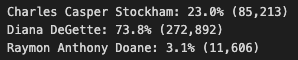

# Election_Analysis

## Project Overview
Performing an election audit of a recent local congressional election for a Colorado Board of Elections employee to determine the winning candidate and the county with the largest number of votes. 

## Resources
- Data Source: election_results.csv
- Software: Python 3.6.1, Visual Studio Code, 1.53.0

## Election-Audit Results
The analysis of the election show that:
- There were 369,711 votes cast in the election.
- Votes cast by county:
    - Jefferson county had 38,855 votes cast which was 10.5% of the total votes.
    - Denver county had 306,055 votes cast which was 82.8% of the total votes. 
    - Arapahoe county had 24,801 votes cast which was 6.7% of the total votes.
    - 
- Denver county had the largest number of votes.
- The candidates were:
    - Charles Casper Stokham
    - Diana DeGette
    - Raymon Anythony Doane
- The candidate results were:
    - Charles Casper Stokham received 23% of the vote and 85,213 number of votes. 
    - Diana DeGette recevied 73.8% of the vote and 272,892 number of votes. 
    - Raymon Anthony Doane received 3.1% of the vote and 11,606 number of votes. 
    - 
- The winner of the election was:
    - Diana DeGette, who received 73.8% of the vote and 272,892 number of votes. 

## Election-Audit Summary
To the election commission, this script can be used for any election by making small adjustments to the script. 
 - If you wanted to perform an election audit for a municipal election, you would just need to change the names of the county list and county votes dictionary referenced throughout the script to "town_list" and "town_votes" instead. Your winning township and vote count tracker would also need to be updated to: 
    - winning_town = ""
    - winning_town_count = 0
    - winning_town_percentage = 0
    - You would extract the township data from the csv file in the same way, using town_name = row[1] assuming the township data is indexed at row 1 in the csv file. 
 - Similarly, if you wanted to perform an election audit of results based on zip code, you would replace the county list and county votes dictionary that is referenced throughout the script to "zip_code_list" and "zip_code_votes" instead. Your winning zip code and vote count tracker would be updated to:
    - winning_zip = ""
    - winning_zip_count = 0
    - winning_zip_percentage = 0
    - You would extract the zip code data from the csv file in the same way, using zip_code = row[1] assuming the zip code data is indexed at row 1 in the csv file.  

